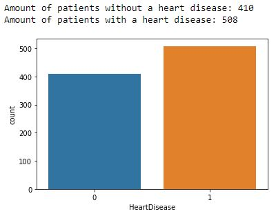

[See the Jupyter Notebook for the full project](https://github.com/VictorDonjuan/Heart-Failure-Prediction/blob/main/Heart%20Failure%20Prediction%20Project.ipynb)

# Heart Failure Prediction with Machine Learning: Overview

In this project, we explore the [heart failure dataset](https://www.kaggle.com/fedesoriano/heart-failure-prediction) that consists of 918 observations, 11 clinical features and 1 response variable. The attribute information is provided as follows: 

1. Age: age of the patient [years]
2. Sex: sex of the patient [M: Male, F: Female]
3. ChestPainType: chest pain type [TA: Typical Angina, ATA: Atypical Angina, NAP: Non-Anginal Pain, ASY: Asymptomatic]
4. RestingBP: resting blood pressure [mm Hg]
5. Cholesterol: serum cholesterol [mm/dl]
6. FastingBS: fasting blood sugar [1: if FastingBS > 120 mg/dl, 0: otherwise]
7. RestingECG: resting electrocardiogram results [Normal: Normal, ST: having ST-T wave abnormality (T wave inversions and/or ST elevation or depression of > 0.05 mV), LVH: showing probable or definite left ventricular hypertrophy by Estes' criteria]
8. MaxHR: maximum heart rate achieved [Numeric value between 60 and 202]
9. ExerciseAngina: exercise-induced angina [Y: Yes, N: No]
10. Oldpeak: oldpeak = ST [Numeric value measured in depression]
11. ST_Slope: the slope of the peak exercise ST segment [Up: upsloping, Flat: flat, Down: downsloping]
12. HeartDisease: output class [1: heart disease, 0: Normal]

The goal is to succesfully predict whether a person has a cardiovascular disease ('HeartDisease'==1) or not ('HeartDisease'==0), and potentially help medical care with early detections. 

# Exploratory Data Analysis 

First, we look at the response variable to check whether or not it's balanced.

We have nearly the same amount of people with a heart disease as without a heart disease in the dataset. This means that we can use the metric 'Accuracy' in order to evaluate the model, but we also took into account several other metrics such as f1_score.

Next, we check the distribution of the clinical features, starting with the numerical ones. Two variables are significantly correlated to 'HeartDisease': 'Age' and 'Oldpeak'. 

In the above histograms, we can notice that increasing 'Age' or 'Oldpeak' leads to a higher likelihood of having a cardiovascular disease.

On the other hand, we see that there are some values in the 'Cholesterol' feature thare are not consistent, because many of them are equal to 0 which is not possible.

However, it turns out that even with these suspicious values the models not only perform well, but also if we tried to feature engineer them we got only worse scores. A possible explanation is that a certain threshold was used to put these values as 0 (same as they did with another feature, 'FastingBS'), which also happened to lead to consistent results. 

After that, we also checked the categorical features. For example, being male makes it almost twice as likely to have a heart disease than being female. 

# Model Building and Results

After checking the features, we proceed to model building. We tried with the following 5 baseline classifier models: Logistic Regression, K-Nearest Neighbors, Support Vector Machine, Random Forests and Gradient Boosting. In the case of the KNN and SVM models, these got huge benefits from scaling the data with a standard scaler. After tuning the models, we obtained the following scores with four metrics:

The KNN model was the one that performed best. We can see here the full report:

- Best Score: 0.90 (Accuracy)

Hence, we can conclude that we built a model with decent performance on predicting a heart disease.
